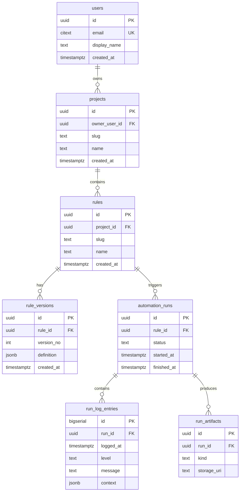

# PostgreSQL Database Design — AutoBot / Playwright Automation Engine

This document describes a relational schema for replacing file-based storage of **automation rules** (JSON) and **logs** (text files) with PostgreSQL. It is optimized for **queryability**, **evolution of rule structure**, and **high-volume structured logging**.

---

## 1. Goals and constraints

| Goal | Approach |
|------|----------|
| Preserve current JSON shapes | Store variable rule metadata and `steps` as **JSONB**; keep first-class columns for fields you filter/sort on often. |
| Normalize where it helps | Separate **rules**, **runs**, and **log lines**; avoid duplicating rule text on every log row (reference `rule_id` / `run_id`). |
| Stay flexible for new step types | New keys inside `steps[]` require **no migration** if stored in JSONB; optional `step_type` registry table later. |
| Queryable logs | **One row per log line** (or batched inserts) with `level`, `message`, `logged_at`, optional `context` JSONB. |
| Performance | B-tree indexes on foreign keys and time; **BRIN** or partitioning on `logged_at` for large append-only tables; GIN on JSONB only where you query inside JSON. |
| Authentication | **`users`** table for login identity (hashed passwords); sessions/tokens handled in app or separate **`user_sessions`** table if needed. |
| Projects | **`projects`** owned by a user; **`rules.project_id`** scopes every rule to exactly one project (new feature vs. current file-only app). |

---

## 2. Current state (baseline)

**Rules (`rules/*.json`)**

- Top-level: `name`, `description`, `author`, `version`, `created`, optional `networkActivity`, `continueOnError`.
- `steps`: array of objects; shape depends on `action` (`navigate`, `click`, `fill`, `wait`, `screenshot`, `validate`, etc.).

**API today**

- Rules identified by **filename** (e.g. `my-rule.json`); save derives name from `rule.name` → slug file name.
- Runs: in-memory `runningProcesses` + spawned process; WebSocket events carry `type`, `message`, `timestamp`, `runId`, `fileName`.

**Logs**

- Winston: `logs/automation.log`, `logs/error.log` (rule engine).
- History API: `logs/*.log` files matched by rule name substring.

The schema below generalizes this into durable **runs** and **log entries** tied to **rules**, with **users**, **projects**, and **`rules.project_id`** for ownership and navigation in the UI.

---

## 3. High-level entity model



**Relationships**

- A **user** creates **projects**; each **rule** belongs to exactly one **project** (`project_id`).
- Optional later: **`project_members`** (many-to-many) for shared projects without giving full account access.

---

## 4. Table definitions

### 4.1 `users` (authentication / login)

Stores application login identity. (Avoid naming the table `user` — it is reserved in PostgreSQL; `users` or `app_users` is standard.)

| Column | Type | Notes |
|--------|------|--------|
| `id` | `UUID` `PRIMARY KEY` `DEFAULT gen_random_uuid()` | |
| `email` | `CITEXT` `NOT NULL` `UNIQUE` | Case-insensitive login; requires `CREATE EXTENSION citext`. Alternatively `TEXT` + unique index on `lower(email)`. |
| `password_hash` | `TEXT` `NOT NULL` | **Argon2id** or **bcrypt** hash only—never store plaintext passwords. |
| `display_name` | `TEXT` | Optional UI name. |
| `is_active` | `BOOLEAN` `NOT NULL` `DEFAULT true` | Disable login without deleting row. |
| `email_verified_at` | `TIMESTAMPTZ` | Optional; if you add verification flows. |
| `last_login_at` | `TIMESTAMPTZ` | Optional audit. |
| `metadata` | `JSONB` `NOT NULL` `DEFAULT '{}'` | Preferences, avatar URL, etc. |
| `created_at` | `TIMESTAMPTZ` `NOT NULL` `DEFAULT now()` | |
| `updated_at` | `TIMESTAMPTZ` `NOT NULL` `DEFAULT now()` | |

**Indexes:** `UNIQUE (email)`; optional `(is_active) WHERE is_active`.

**Sessions / tokens (optional separate tables)**

- **`user_sessions`**: `id`, `user_id`, `refresh_token_hash`, `expires_at`, `user_agent`, `created_at` — if you use refresh tokens stored server-side.
- Or keep **stateless JWT** validation in the API with no session table (still store `password_hash` in `users` for login).

---

### 4.2 `projects`

A **project** is a user-defined container for rules (new product feature). Rules are always scoped by `project_id`.

| Column | Type | Notes |
|--------|------|--------|
| `id` | `UUID` `PRIMARY KEY` `DEFAULT gen_random_uuid()` | |
| `owner_user_id` | `UUID` `NOT NULL` `REFERENCES users(id) ON DELETE RESTRICT` | Primary owner; use `project_members` later for collaborators. |
| `name` | `TEXT` `NOT NULL` | Display name. |
| `slug` | `TEXT` `NOT NULL` | URL-safe segment; **unique per owner**, not necessarily globally—see constraints. |
| `description` | `TEXT` | Optional. |
| `metadata` | `JSONB` `NOT NULL` `DEFAULT '{}'` | Tags, color, external IDs. |
| `created_at` | `TIMESTAMPTZ` `NOT NULL` `DEFAULT now()` | |
| `updated_at` | `TIMESTAMPTZ` `NOT NULL` `DEFAULT now()` | |
| `deleted_at` | `TIMESTAMPTZ` | Soft delete. |

**Constraints:** `UNIQUE (owner_user_id, slug)` so two projects for the same user cannot share a slug; different users may reuse the same slug string.

**Indexes:** `(owner_user_id)`; partial index where `deleted_at IS NULL`.

---

### 4.3 `rules`

Canonical row per automation rule (replaces one JSON file per rule). **Every rule is tied to a project.**

| Column | Type | Notes |
|--------|------|--------|
| `id` | `UUID` `PRIMARY KEY` `DEFAULT gen_random_uuid()` | Stable identifier; API can move away from filename. |
| `project_id` | `UUID` `NOT NULL` `REFERENCES projects(id) ON DELETE RESTRICT` | Required; scope for dashboards and ACLs. |
| `slug` | `TEXT` `NOT NULL` | URL-safe; **unique within the project**—see constraints. |
| `name` | `TEXT` `NOT NULL` | Display name (current `name`). |
| `description` | `TEXT` | Optional. |
| `author` | `TEXT` | Optional; may become redundant with `users` / audit columns. |
| `metadata` | `JSONB` `NOT NULL` `DEFAULT '{}'` | Extra top-level fields (e.g. tags, `created` string migration, UI-only keys) without migrations. |
| `network_activity` | `BOOLEAN` `DEFAULT false` | Mirrors `networkActivity`. |
| `continue_on_error` | `BOOLEAN` `DEFAULT false` | Mirrors `continueOnError`. |
| `current_version` | `INT` `NOT NULL` `DEFAULT 1` | Points at latest `rule_versions.version_no` (optional if you only keep one row per rule). |
| `created_at` | `TIMESTAMPTZ` `NOT NULL` `DEFAULT now()` | |
| `updated_at` | `TIMESTAMPTZ` `NOT NULL` `DEFAULT now()` | Maintain via trigger or application. |
| `deleted_at` | `TIMESTAMPTZ` | Soft delete; keeps history and FK integrity. |

**Constraints:** `UNIQUE (project_id, slug)` — replaces a single global `UNIQUE (slug)` so the same rule slug can exist in different projects.

**Indexes:** `(project_id)`; `(project_id, slug)`; partial index on `deleted_at IS NULL` for active rules if soft-delete is used.

---

### 4.4 `rule_versions` (optional but recommended)

Versioned snapshots of the full rule document for **audit**, **rollback**, and safe edits.

| Column | Type | Notes |
|--------|------|--------|
| `id` | `UUID` `PRIMARY KEY` | |
| `rule_id` | `UUID` `NOT NULL` `REFERENCES rules(id) ON DELETE CASCADE` | |
| `version_no` | `INT` `NOT NULL` | Monotonic per `rule_id`. |
| `definition` | `JSONB` `NOT NULL` | Full document: `steps`, and any fields you choose not to denormalize (or mirror top-level into columns + `steps` only in JSONB). |
| `created_at` | `TIMESTAMPTZ` `NOT NULL` `DEFAULT now()` | |
| `created_by` | `UUID` `REFERENCES users(id)` | Optional; who published this version. |

**Constraints:** `UNIQUE (rule_id, version_no)`.

**Indexes:** `(rule_id, version_no DESC)` for “latest N versions”.

**Alternative (simpler MVP):** Single `rules.definition JSONB` and no `rule_versions` until you need history.

---

### 4.5 `automation_runs`

One row per execution (replaces ephemeral run tracking + ties logs together).

| Column | Type | Notes |
|--------|------|--------|
| `id` | `UUID` `PRIMARY KEY` `DEFAULT gen_random_uuid()` | Use as `runId` in API/WebSocket. |
| `rule_id` | `UUID` `NOT NULL` `REFERENCES rules(id)` | |
| `rule_version_id` | `UUID` `REFERENCES rule_versions(id)` | Optional; which snapshot ran. |
| `status` | `TEXT` `NOT NULL` | e.g. `queued`, `running`, `succeeded`, `failed`, `cancelled`, `timeout`. |
| `exit_code` | `INT` | Process exit code when applicable. |
| `started_at` | `TIMESTAMPTZ` `NOT NULL` `DEFAULT now()` | |
| `finished_at` | `TIMESTAMPTZ` | |
| `trigger_source` | `TEXT` | e.g. `api`, `schedule`, `cli`. |
| `triggered_by_user_id` | `UUID` `REFERENCES users(id)` | Optional; who clicked Run (if authenticated). |
| `environment` | `JSONB` `DEFAULT '{}'` | Hostname, `HEADLESS`, browser type, git SHA, etc. |
| `summary` | `JSONB` | Optional: engine summary (`executed`, `failed`, `executionTime`, `extractedData` keys). |

**Indexes:** `(rule_id, started_at DESC)`; `(status)` if you poll running jobs.

---

### 4.6 `run_log_entries`

Structured, queryable log lines (replaces tailing `.log` files and WS-only history).

| Column | Type | Notes |
|--------|------|--------|
| `id` | `BIGSERIAL` `PRIMARY KEY` | High volume; bigint range. |
| `run_id` | `UUID` `NOT NULL` `REFERENCES automation_runs(id) ON DELETE CASCADE` | |
| `logged_at` | `TIMESTAMPTZ` `NOT NULL` `DEFAULT now()` | Server receipt time or parsed from line. |
| `seq` | `BIGINT` | Optional monotonic sequence per run for strict ordering. |
| `level` | `TEXT` `NOT NULL` | `debug`, `info`, `warn`, `error`, or map WS `type` (`info`/`error`/`success`). |
| `message` | `TEXT` `NOT NULL` | Single line or normalized multiline stored as one row. |
| `source` | `TEXT` | e.g. `stdout`, `stderr`, `engine`, `api`. |
| `context` | `JSONB` `DEFAULT '{}'` | `step_id`, `action`, stack snippets, small structured fields—avoid huge blobs here. |

**Indexes**

- `(run_id, logged_at)` or `(run_id, seq)` for UI “logs for this run”.
- **Partitioning** (optional): `PARTITION BY RANGE (logged_at)` monthly when volume grows.
- **BRIN** on `logged_at` if table is append-only and very large.

**Retention:** Archive partitions to cold storage or drop after N days via scheduled job.

---

### 4.7 `run_artifacts` (optional, scalable binary metadata)

Screenshots and exports today live on disk under `screenshots/`; this table stores **references**, not necessarily BYTEA (keeps DB lean).

| Column | Type | Notes |
|--------|------|--------|
| `id` | `UUID` `PRIMARY KEY` | |
| `run_id` | `UUID` `NOT NULL` `REFERENCES automation_runs(id) ON DELETE CASCADE` | |
| `kind` | `TEXT` | `screenshot`, `trace`, `har`, `export`. |
| `file_name` | `TEXT` | |
| `storage_uri` | `TEXT` | Path or `s3://...` URL. |
| `mime_type` | `TEXT` | |
| `metadata` | `JSONB` | Width/height, step id, etc. |
| `created_at` | `TIMESTAMPTZ` `NOT NULL` `DEFAULT now()` | |

---

### 4.8 Application / system logs (optional separation)

Winston file logs for the **API process** (not per automation run) may be kept in files or in a separate table:

- `app_log_entries` — same shape as `run_log_entries` but without `run_id`, with `service` (`api`, `worker`).

This avoids mixing **orchestration** logs with **automation stdout** unless you prefer a single table with nullable `run_id`.

---

## 5. JSONB usage guidelines

1. **`rule_versions.definition` (or `rules.definition`)** 
 - Store the full rule including `steps` array. 
 - New `action` types add new keys inside `steps[]` without DDL changes.

2. **`metadata` / `environment` / `context`** 
 - Use for searchable facets only if you add **generated columns** or **GIN** indexes later; otherwise treat as opaque.

3. **Query patterns** 
 - Prefer columns for: `project_id`, `slug`, `name`, `status`, `started_at`, `level`. 
 - List rules as: `SELECT … FROM rules WHERE project_id = $1 AND deleted_at IS NULL`. 
 - Use `definition @> '{"steps":[...]}'` sparingly; can be expensive without GIN.

4. **Validation** 
 - Enforce JSON Schema in the application layer, or use `CHECK` constraints with `jsonb_typeof` for minimal guards; optional PostgreSQL extension for full JSON Schema validation.

---

## 6. Logging strategy (efficiency + queryability)

| Concern | Recommendation |
|---------|------------------|
| Write volume | Batch inserts from API/worker (e.g. every 100 ms or N lines); use `COPY` for bulk backfill. |
| Hot reads | Recent runs only; paginate `run_log_entries` by `(run_id, id)` or `(run_id, logged_at)`. |
| Full-text search | `to_tsvector` on `message` only if needed; index with GIN. |
| Large stdout | Truncate or summarize in `message`; store overflow in object storage with URI in `context`. |
| Correlation | Always set `run_id` on every line; propagate same UUID as today’s `runId`. |

---

## 7. Migration mapping (files → tables)

| File / concept | Target |
|----------------|--------|
| New installs | Create at least one **`users`** row (or use first signup); create a **default `project`** per user or per workspace; all new **`rules`** set `project_id`. |
| `rules/<slug>.json` | `rules.slug` + `project_id` (from migration bucket) + `rule_versions.definition` (or `rules.definition`) |
| Rule list API | `SELECT` from `rules` WHERE `project_id = $1` AND `deleted_at IS NULL`; join latest version for `steps` |
| Run + WS logs | Insert `automation_runs` at start; append `run_log_entries` for each chunk |
| `logs/*.log` history | Parse lines → insert into `run_log_entries` linked to reconstructed or new `automation_runs` (backfill may be best-effort) |
| Screenshots | `run_artifacts` + existing files or migrated object storage |

**Slug collision:** Current save uses `name` → kebab-case; enforce **`UNIQUE (project_id, slug)`** (not global slug). Handle renames explicitly (update `slug` or keep immutable slug).

**Backfill strategy:** For existing JSON files without projects, create a placeholder project (e.g. name “Legacy import”, `owner_user_id` = admin or system user) and assign all imported rules to `project_id` of that project.

---

## 8. Performance and maintainability

- **Connections:** Use pooler (PgBouncer) in production.
- **Migrations:** Flyway, Liquibase, or `node-pg-migrate` / Prisma Migrate — versioned SQL.
- **Vacuum:** Autovacuum; monitor bloat on high-churn `run_log_entries`.
- **Read replicas:** For dashboards querying history; keep writes on primary.
- **Idempotency:** `automation_runs.id = client-supplied UUID` optional for safe retries.

---

## 9. Future extensions (no immediate schema lock-in)

- **Scheduling:** `schedules` table referencing `rule_id`, `cron`, `next_run_at`.
- **Multi-user projects:** `project_members` (`project_id`, `user_id`, `role`) with PostgreSQL **RLS** on `rules` / `projects` so collaborators only see allowed projects.
- **Org / tenancy:** Optional `organizations` above `projects`, or `tenant_id` on `projects` with RLS.
- **Secrets:** Do not store passwords inside `definition` JSON; reference `secret_id` to vault.
- **Step catalog:** `step_action_types` lookup for UI validation and analytics.
- **Feature flags per rule:** `rules.metadata` or `rules.flags JSONB`.

---

## 10. Example DDL sketch (PostgreSQL 14+)

```sql
CREATE EXTENSION IF NOT EXISTS citext;

CREATE TABLE users (
 id UUID PRIMARY KEY DEFAULT gen_random_uuid(),
 email CITEXT NOT NULL UNIQUE,
 password_hash TEXT NOT NULL,
 display_name TEXT,
 is_active BOOLEAN NOT NULL DEFAULT true,
 email_verified_at TIMESTAMPTZ,
 last_login_at TIMESTAMPTZ,
 metadata JSONB NOT NULL DEFAULT '{}',
 created_at TIMESTAMPTZ NOT NULL DEFAULT now(),
 updated_at TIMESTAMPTZ NOT NULL DEFAULT now()
);

CREATE TABLE projects (
 id UUID PRIMARY KEY DEFAULT gen_random_uuid(),
 owner_user_id UUID NOT NULL REFERENCES users(id) ON DELETE RESTRICT,
 name TEXT NOT NULL,
 slug TEXT NOT NULL,
 description TEXT,
 metadata JSONB NOT NULL DEFAULT '{}',
 created_at TIMESTAMPTZ NOT NULL DEFAULT now(),
 updated_at TIMESTAMPTZ NOT NULL DEFAULT now(),
 deleted_at TIMESTAMPTZ,
 UNIQUE (owner_user_id, slug)
);

CREATE TABLE rules (
 id UUID PRIMARY KEY DEFAULT gen_random_uuid(),
 project_id UUID NOT NULL REFERENCES projects(id) ON DELETE RESTRICT,
 slug TEXT NOT NULL,
 name TEXT NOT NULL,
 description TEXT,
 author TEXT,
 metadata JSONB NOT NULL DEFAULT '{}',
 network_activity BOOLEAN NOT NULL DEFAULT false,
 continue_on_error BOOLEAN NOT NULL DEFAULT false,
 current_version INT NOT NULL DEFAULT 1,
 created_at TIMESTAMPTZ NOT NULL DEFAULT now(),
 updated_at TIMESTAMPTZ NOT NULL DEFAULT now(),
 deleted_at TIMESTAMPTZ,
 UNIQUE (project_id, slug)
);

CREATE TABLE rule_versions (
 id UUID PRIMARY KEY DEFAULT gen_random_uuid(),
 rule_id UUID NOT NULL REFERENCES rules(id) ON DELETE CASCADE,
 version_no INT NOT NULL,
 definition JSONB NOT NULL,
 created_by UUID REFERENCES users(id),
 created_at TIMESTAMPTZ NOT NULL DEFAULT now(),
 UNIQUE (rule_id, version_no)
);

CREATE TABLE automation_runs (
 id UUID PRIMARY KEY DEFAULT gen_random_uuid(),
 rule_id UUID NOT NULL REFERENCES rules(id),
 rule_version_id UUID REFERENCES rule_versions(id),
 status TEXT NOT NULL,
 exit_code INT,
 started_at TIMESTAMPTZ NOT NULL DEFAULT now(),
 finished_at TIMESTAMPTZ,
 trigger_source TEXT,
 triggered_by_user_id UUID REFERENCES users(id),
 environment JSONB NOT NULL DEFAULT '{}',
 summary JSONB
);

CREATE TABLE run_log_entries (
 id BIGSERIAL PRIMARY KEY,
 run_id UUID NOT NULL REFERENCES automation_runs(id) ON DELETE CASCADE,
 logged_at TIMESTAMPTZ NOT NULL DEFAULT now(),
 seq BIGINT,
 level TEXT NOT NULL,
 message TEXT NOT NULL,
 source TEXT,
 context JSONB NOT NULL DEFAULT '{}'
);

CREATE INDEX idx_projects_owner ON projects (owner_user_id);
CREATE INDEX idx_rules_project ON rules (project_id);
CREATE INDEX idx_runs_rule_started ON automation_runs (rule_id, started_at DESC);
CREATE INDEX idx_logs_run_time ON run_log_entries (run_id, logged_at);
```

*(Adjust types, `ON DELETE` behavior, and partitioning to match your retention and compliance needs.)*

---

## 11. Summary

- **Users:** **`users`** holds login identity and **`password_hash`** (Argon2id/bcrypt); optional **`user_sessions`** if you store refresh tokens server-side.
- **Projects:** **`projects`** are user-owned containers; **`UNIQUE (owner_user_id, slug)`** scopes slugs per user.
- **Rules:** Every rule has **`project_id`** → **`projects`**; **`UNIQUE (project_id, slug)`** replaces a global slug.
- **Rules (content):** **JSONB** for variable `steps` (and optional **version** history in **`rule_versions`**).
- **Runs:** **automation_runs** with optional **`triggered_by_user_id`** for audit.
- **Logs:** **run_log_entries** as structured, indexed rows; scale with **partitioning** and retention policies.
- **Artifacts:** Optional **run_artifacts** for screenshot/file paths without bloating the database.

This design matches today’s JSON flexibility while giving you **relational integrity**, **queryable history**, **authenticated users**, **project-scoped rules**, and a clear path to collaboration (project members) and scheduling.
