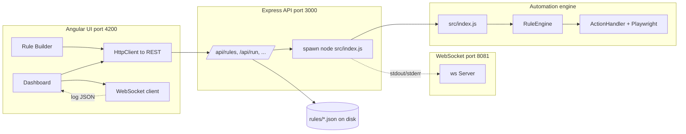

# Application architecture (Angular, Node, rules, WebSockets)

This document describes how the **AutoBot UI (Angular)**, **API + WebSocket server (Node/Express)**, **Playwright automation engine (Node)**, and **rule JSON files** work together. Line numbers point to the current codebase so you can jump to implementations; they may shift slightly after future edits—search by symbol if a line no longer matches.

---

## Big picture

---

## 1. What Angular does (`autobot-ui/`)

**Role:** Browser app for **listing rules**, **creating/editing rules**, **starting/stopping runs**, and **showing live log lines** via WebSocket. It does **not** run Playwright itself; it calls the API.

| Concern | Location | Lines (reference) |
|--------|-----------|---------------------|
| Routes (`/dashboard`, `/builder`) | `autobot-ui/src/app/app.routes.ts` | 5–9 |
| Dashboard: load rules, run/stop, subscribe to logs | `autobot-ui/src/app/components/dashboard/dashboard.component.ts` | 40–66 (init: `loadRules`, `connectWebSocket`, `getLogs`) |
| Rule Builder: form → save/update rule JSON via API | `autobot-ui/src/app/components/rule-builder/rule-builder.component.ts` | `saveRule`, `loadRuleForEdit` |
| HTTP API calls (rules CRUD, run, stop) | `autobot-ui/src/app/services/automation.service.ts` | 85–115 (`getRules`, `saveRule`, `updateRule`, `runRule`, …) |
| WebSocket connect + parse messages into RxJS stream | `autobot-ui/src/app/services/automation.service.ts` | 21–58 (`connectWebSocket`, `onmessage` → `logSubject`) |
| API / WS base URLs | `autobot-ui/src/environments/environment.ts` | 14–15 (`apiUrl`, `wsUrl`), 20 (`enableWebSocket`) |
| Edit flow: pass rule into builder | `autobot-ui/src/app/services/rule-edit.service.ts` | (navigation state; open file for full API) |

**Typical flow**

1. User opens **Dashboard** → `getRules()` → `GET /api/rules` (see `automation.service.ts` ~85–87).
2. User clicks **Run** → `runRule(fileName)` → `POST /api/run/:fileName` (~101–103).
3. Dashboard calls `connectWebSocket()` once (~49) and subscribes to `getLogs()` (~50–60) to append live log objects.

---

## 2. What the Node API does (`api/server.js`)

**Role:** **REST API** on port **3000** (default), **static** files, **rules directory** I/O, and **spawning** the automation engine. Also hosts a **WebSocket** server on port **8081** (default) for log streaming.

| Concern | File | Lines (reference) |
|--------|------|---------------------|
| Ports: HTTP `PORT`, WS `WEBSOCKET_PORT` | `api/server.js` | 11–13 |
| WebSocket server + client set | `api/server.js` | 20–31 |
| `broadcast(data)` → all WS clients | `api/server.js` | 34–40 |
| UI config including `wsUrl` | `api/server.js` | 44–70 (`/api/config`) |
| Rules directory | `api/server.js` | 78–86 |
| List / create / update / delete rules | `api/server.js` | 88–154 |
| **Run rule**: `spawn('node', [automationScript, rulePath])` | `api/server.js` | 159–245 |
| Pipe stdout/stderr to `broadcast(log)` | `api/server.js` | 191–212 |
| Process exit → `broadcast` + remove from `runningProcesses` | `api/server.js` | 214–225 |
| Stop / stop-all / list running | `api/server.js` | 247–283 (approx.) |
| `app.listen(PORT)` + startup logs | `api/server.js` | 424–431 |

**Important:** The API runs automation by spawning **`src/index.js`** with the rule file path (see `automationScript` / `PROJECT_ROOT` env around 176–178). The child process’s **console output** is what gets pushed over WebSockets—not a separate logging database.

---

## 3. What the “core Node” automation engine does (`src/`)

**Role:** **Playwright**-based execution of a **single rule file**: open browser, run steps, write logs (stdout), exit code.

| Concern | File | Lines (reference) |
|--------|------|---------------------|
| CLI entry: `node src/index.js <rule.json>` | `src/index.js` | 14–37 (`main`, `RuleEngine.run`) |
| Load/parse JSON, validate `name` + `steps` | `src/engine/ruleEngine.js` | 24–66 (`loadRules`, `validateRules`) |
| Launch browser, create page, run steps | `src/engine/ruleEngine.js` | 71–120+ (`initBrowser`), 133–205 (`executeRules`) |
| Between-step delay: `delayAfter` or `STEP_DELAY` (default 3000 ms) | `src/engine/ruleEngine.js` | 195–204 |
| Dispatch step `action` → handler | `src/actions/actionHandler.js` | 176–234 (`execute` switch: `navigate`, `click`, `fill`, `wait`, …) |
| Config (timeouts, `STEP_DELAY`, browser) | `src/utils/config.js` | 1–43 |
| Env defaults | `src/utils/environmentLoader.js` | (e.g. `STEP_DELAY` near 131–134) |

**Direct CLI use (no Angular):** from repo root, `node src/index.js rules/my-rule.json` — same engine the API spawns.

---

## 4. What “rules” are (`rules/*.json`)

**Role:** **Declarative automation**: one JSON object per file, with `steps[]`. Each step has `stepId`, `action`, and action-specific fields (`url`, `selector`, `selectorMode`, `text`, `duration`, etc.).

| Concern | Location | Notes |
|--------|----------|--------|
| On-disk storage | Default `rules/` next to project root | Overridable via `RULES_DIR` (see `api/server.js` ~79) |
| Loaded by API for listing/editing | `GET/POST/PUT/DELETE /api/rules` | `api/server.js` ~88–154 |
| Consumed by engine | `RuleEngine.loadRules` | `src/engine/ruleEngine.js` ~24–37 |
| Extra documentation (waits, targets) | `docs/automation-rules-waiting-and-targets.md` | Deep dive on `selectorMode`, delays, load waits |

The **file name** used by the UI/API (e.g. `test11.json`) is what `/api/run/:fileName` passes to `src/index.js`.

---

## 5. What WebSockets do

**Server side**

| Concern | File | Lines (reference) |
|--------|------|---------------------|
| Standalone `ws` server on `WS_PORT` | `api/server.js` | 20–22, 428 |
| Each connected browser client stored in `Set` | `api/server.js` | 22–31 |
| `broadcast` used when automation stdout/stderr/exit fires | `api/server.js` | 34–40, 200, 211, 222 |

**Client side**

| Concern | File | Lines (reference) |
|--------|------|---------------------|
| `new WebSocket(wsUrl)` | `autobot-ui/src/app/services/automation.service.ts` | 31–46 |
| Parse JSON log lines → `logSubject` | `autobot-ui/src/app/services/automation.service.ts` | 39–45 |
| Dashboard subscribes for live log UI | `autobot-ui/src/app/components/dashboard/dashboard.component.ts` | 48–60 |

**Payload shape (from API):** objects like `{ type, message, timestamp, runId, fileName }` built in `api/server.js` ~193–221.

**Note:** If `enableWebSocket` is false in `environment.ts`, the UI skips connecting (`automation.service.ts` ~26–28).

---

## 6. How everything starts together (`npm run dev`)

| Script | File | Role |
|--------|------|------|
| `npm run dev` | `package.json` → `batchScripts/run-all.js` | Starts API (3000), Angular (4200), etc. (see script header ~4–10) |

---

## 7. Quick reference table

| Layer | Technology | Responsibility |
|-------|------------|----------------|
| UI | Angular 17+ standalone | Rule CRUD UI, run triggers, log viewer |
| API | Express | REST, spawn engine, WS broadcast |
| Engine | Node + Playwright | Real browser automation |
| Rules | JSON | Step definitions |
| WS | `ws` package | Stream child process output to UI |

---

## 8. Line number disclaimer

Line numbers are **accurate for the snapshot of the repo when this file was written**. After merges/refactors, use your editor’s **Go to symbol** or **search** (e.g. `executeRules`, `app.post('/api/run`) to re-anchor.

---

*Generated for the Node_Automation / Playwright Automation Engine project.*
